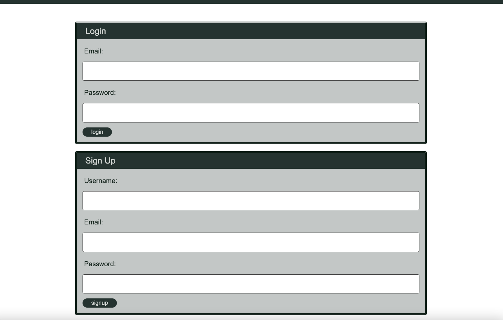
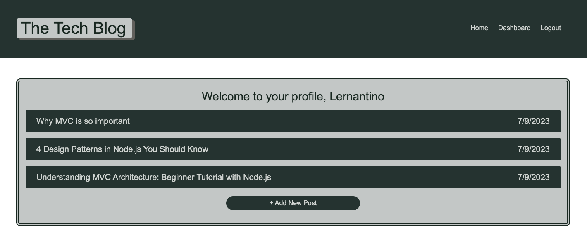
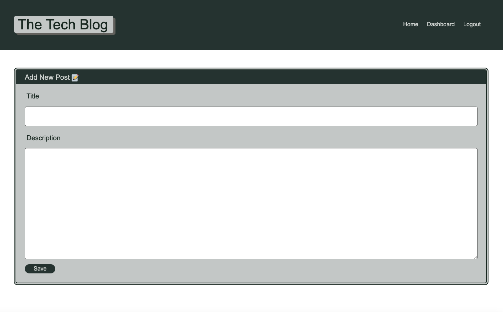

# The Tech Blog

[](https://opensource.org/licenses/MIT)

## Description

The project helps to to build a CMS-style blog which follows the MVC paradigm in its architectural structure, using Handlebars.js as the templating language, Sequelize as the ORM, and the express-session npm package for authentication.

## Installation

- Install Node.js v16
- Install MySQL Server
- Clone the Repository from GitHub and navigate to the root directory
- Install necessary dependencies running the following command :

  ```
  npm i
  ```

- Create a .env file in the root directory and add the environment variables to hold your MySQL username, password and database name.

      DB_NAME='techblog_db'
      DB_USER='root'
      DB_PW='password'

- Login into MySQL by running the command

  ```
   mysql -u root -p
  ```

- Run the following command in the shell to create the database.

  ```
  source db/schema.sql
  ```

- Run the following command in the shell to seed the database.

  ```
  npm run seed
  ```

## Usage


#### Link to deployed application 

https://murmuring-shelf-04632-c5a4a7d4538b.herokuapp.com/


The application can be invoked in the terminal by using the following command:

```
npm start
```

When the application is invoked using 'npm start' then the server will start listening on port 3001 and the application can be invoked at http://localhost:3001/

The following images show the application's appearance and functionality :

**Home Page**


**Post details**


**Log in / Sign Up**



**Dashboard**



**Add Post**



**Update and Delete**


## Credits

#### References

https://stackoverflow.com/questions/5570390/resize-event-for-textarea

https://sequelize.org/docs/v7/models/data-types/

https://css-tricks.com/auto-growing-inputs-textareas/

## License

[MIT](https://opensource.org/licenses/MIT) license.
