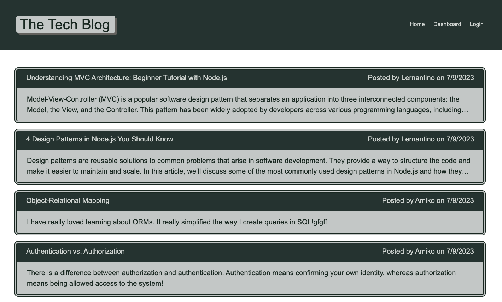

# The Tech Blog

[](https://opensource.org/licenses/MIT)

## Description

The project helps to build a CMS-style blog site where developers can publish their blog posts and comment on other developers’ posts as well. They can also update or delete their posts. This application follows the MVC paradigm in its architectural structure, using Handlebars.js as the templating language, Sequelize as the ORM, and the express-session npm package for authentication.

## Installation

- Install Node.js v16
- Install MySQL Server
- Clone the Repository from GitHub and navigate to the root directory
- Install necessary dependencies running the following command :

  ```
  npm i
  ```

- Create a .env file in the root directory and add the environment variables to hold your MySQL username, password and database name.

      DB_NAME='techblog_db'
      DB_USER='root'
      DB_PW='password'

- Login into MySQL by running the command

  ```
   mysql -u root -p
  ```

- Run the following command in the shell to create the database.

  ```
  source db/schema.sql
  ```

- Run the following command in the shell to seed the database.

  ```
  npm run seed
  ```

## Usage

The user is presented with the home page which includes existing blog posts and navigation links to the dashboard ,login and home at the top right side of the page when the application is opened. When the user clicks on any of the existing blog posts, then the details of that blog will be displayed with the title ,description ,name of the author and the date created along with the comments. The comment section includes the name of the person who commented and date with each comment. The user will be able to see the details and comments on a post but won't be able to write a comment unless they are logged in. When the user clicks on any of the other navigation links than home, he/she will be redirected to the login page . The users can create an account by providing username ,email and password. On sign up and log in  they will be redirected to the dashboard where they will be able to see all the post titles along with date created by them and an option to add new post. When one of the posts are clicked they will be presented with the title and description of that post where they can update or delete. On session time out the users will be redirected to log in page before they can comment, add, update or delete a post.

#### Link to deployed application 

https://murmuring-shelf-04632-c5a4a7d4538b.herokuapp.com/


The application can be invoked in the terminal by using the following command:

```
npm start
```

When the application is invoked using 'npm start' then the server will start listening on port 3001 and the application can be invoked at http://localhost:3001/

The following images show the web application's appearance and functionality :

**Home Page**



**Post details**


**Log in / Sign Up**


**Dashboard**


**Add Post**


**Update and Delete**


**404**


## Credits

#### References

https://stackoverflow.com/questions/5570390/resize-event-for-textarea

https://sequelize.org/docs/v7/models/data-types/

https://css-tricks.com/auto-growing-inputs-textareas/

## License

[MIT](https://opensource.org/licenses/MIT) license.
